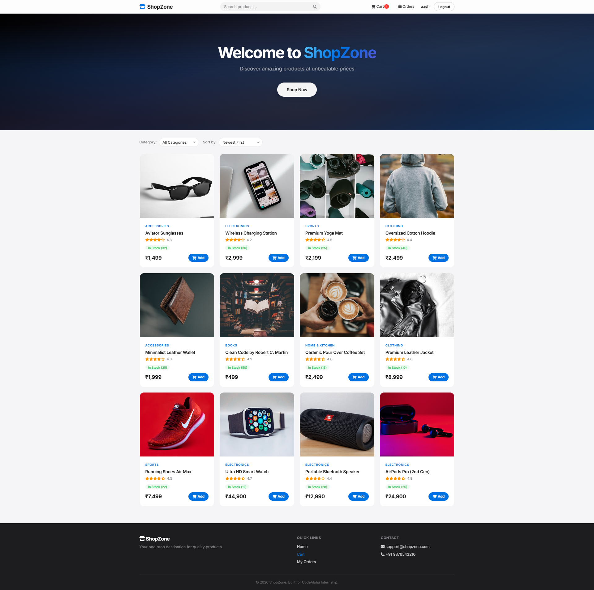
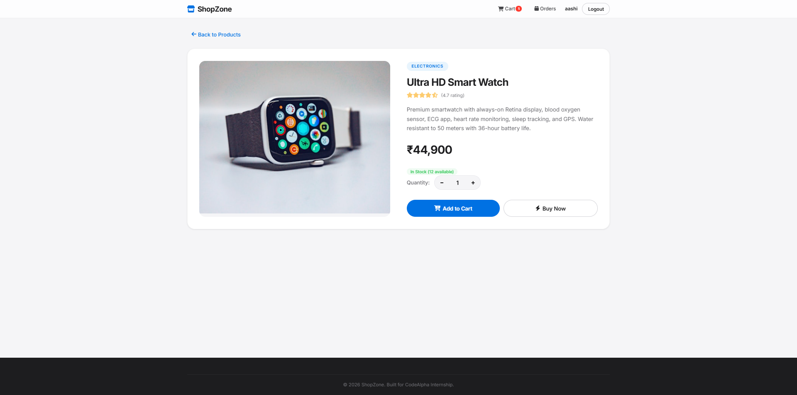
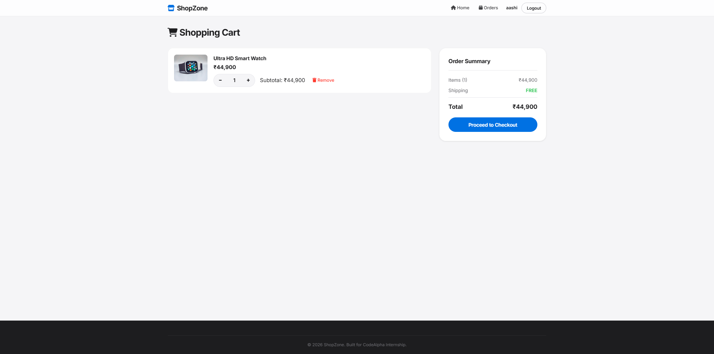
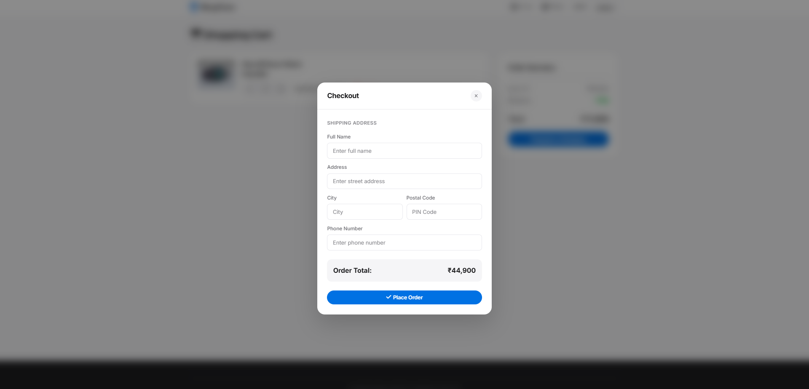

# 🛒 ShopZone - E-Commerce Store

A full-stack e-commerce web application built with Node.js, Express.js, MongoDB, and vanilla JavaScript. Features a clean Apple-inspired design with glassmorphism navbar, smooth animations, and responsive layout.

**CodeAlpha Full Stack Development Internship — Task 1**

## ✨ Features

- **Product Listings** — Browse 12+ products with real-time search, category filter, and sorting
- **Product Details** — View detailed product info with quantity selection and image zoom
- **Shopping Cart** — Add/remove items, adjust quantities, persistent cart using localStorage
- **User Authentication** — Register & login with JWT-based authentication and bcrypt password hashing
- **Order Processing** — Checkout with shipping address form, order validation, and stock management
- **My Orders** — View complete order history with status tracking
- **Responsive Design** — Fully responsive across desktop, tablet, and mobile devices
- **Modern UI** — Glassmorphism navbar, staggered card animations, smooth hover transitions

## 🛠 Tech Stack

- **Frontend:** HTML5, CSS3, JavaScript (ES6+)
- **Backend:** Node.js, Express.js
- **Database:** MongoDB with Mongoose ODM
- **Authentication:** JWT (JSON Web Tokens) + bcrypt
- **Architecture:** RESTful API + MVC Pattern

## 📸 Screenshots

### Homepage - Product Listing


### Product Detail Page


### Shopping Cart


### Checkout Modal


## 📁 Project Structure

```
CodeAlpha_EcommerceStore/
├── server.js              # Express server entry point
├── config/
│   └── db.js              # MongoDB connection
├── models/
│   ├── User.js            # User schema (auth)
│   ├── Product.js         # Product schema
│   └── Order.js           # Order schema
├── routes/
│   ├── auth.js            # Register/Login endpoints
│   ├── products.js        # Product CRUD endpoints
│   └── orders.js          # Order endpoints
├── middleware/
│   └── auth.js            # JWT verification middleware
├── seeds/
│   └── seed.js            # Sample product data seeder
├── public/
│   ├── index.html         # Homepage (product listing)
│   ├── product.html       # Product detail page
│   ├── cart.html           # Shopping cart + checkout
│   ├── login.html         # Login page
│   ├── register.html      # Registration page
│   ├── orders.html        # Order history page
│   ├── css/style.css      # Styles
│   └── js/
│       ├── auth.js        # Auth state management
│       ├── cart.js         # Cart logic (localStorage)
│       ├── main.js        # Product listing & search
│       ├── product.js     # Product detail page
│       ├── checkout.js    # Cart rendering & checkout
│       └── orders.js      # Orders page
└── package.json
```

## 🚀 Setup & Installation

### Prerequisites
- [Node.js](https://nodejs.org/) (v16 or higher)
- [MongoDB Atlas](https://www.mongodb.com/atlas) (free cloud database)

### Steps

1. **Clone the repository**
   ```bash
   git clone https://github.com/aashi40802/CodeAlpha_EcommerceStore.git
   cd CodeAlpha_EcommerceStore
   ```

2. **Install dependencies**
   ```bash
   npm install
   ```

3. **Configure environment variables**
   Create a `.env` file:
   ```
   PORT=5000
   MONGODB_URI=your_mongodb_connection_string
   JWT_SECRET=shopzone_secret_key_change_this_in_production
   ```

4. **Seed the database** (add sample products)
   ```bash
   npm run seed
   ```

5. **Start the server**
   ```bash
   npm run dev
   ```

6. **Open in browser**
   ```
   http://localhost:5000
   ```

## 📡 API Endpoints

| Method | Endpoint | Description | Auth |
|--------|----------|-------------|------|
| POST | `/api/auth/register` | Register new user | No |
| POST | `/api/auth/login` | Login user | No |
| GET | `/api/auth/me` | Get current user | Yes |
| GET | `/api/products` | Get all products (search, filter, sort) | No |
| GET | `/api/products/:id` | Get single product | No |
| POST | `/api/orders` | Create new order | Yes |
| GET | `/api/orders/my-orders` | Get user's orders | Yes |

## 👨‍💻 Author

**Aashi** — CodeAlpha Full Stack Development Intern

## 📄 License

This project is built for educational purposes as part of the CodeAlpha Internship Program.